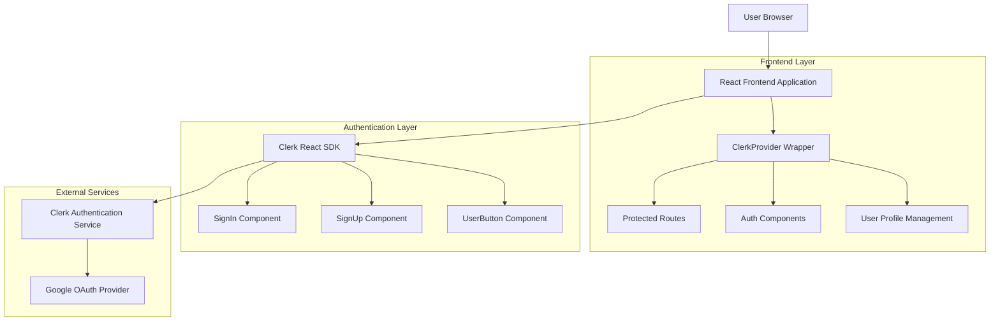
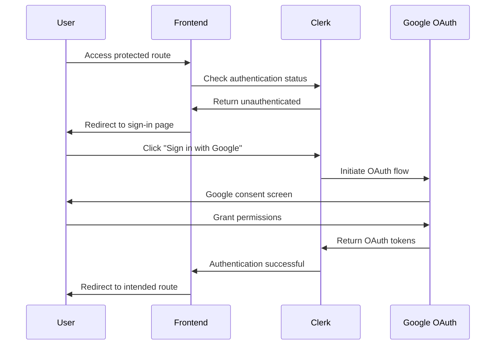
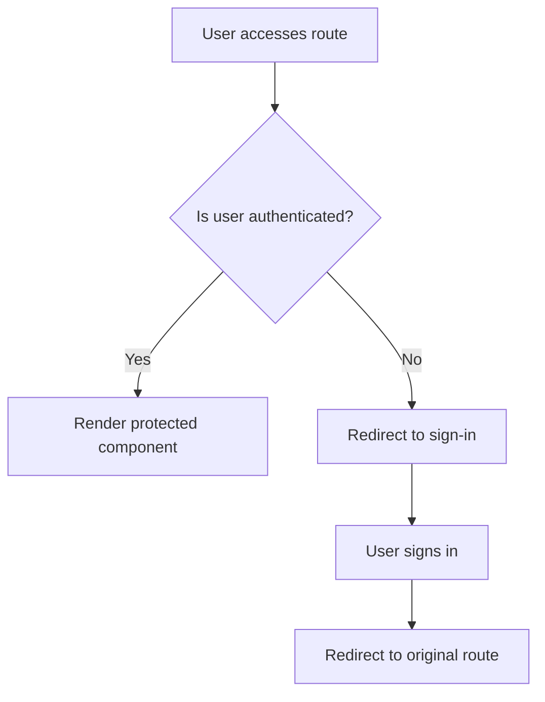
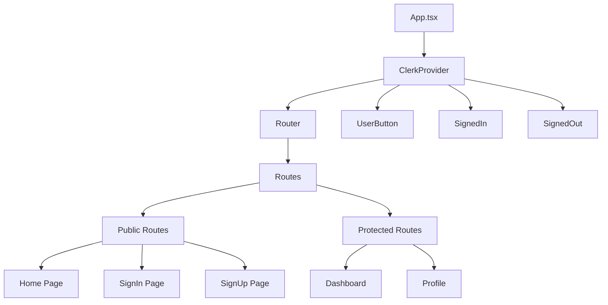
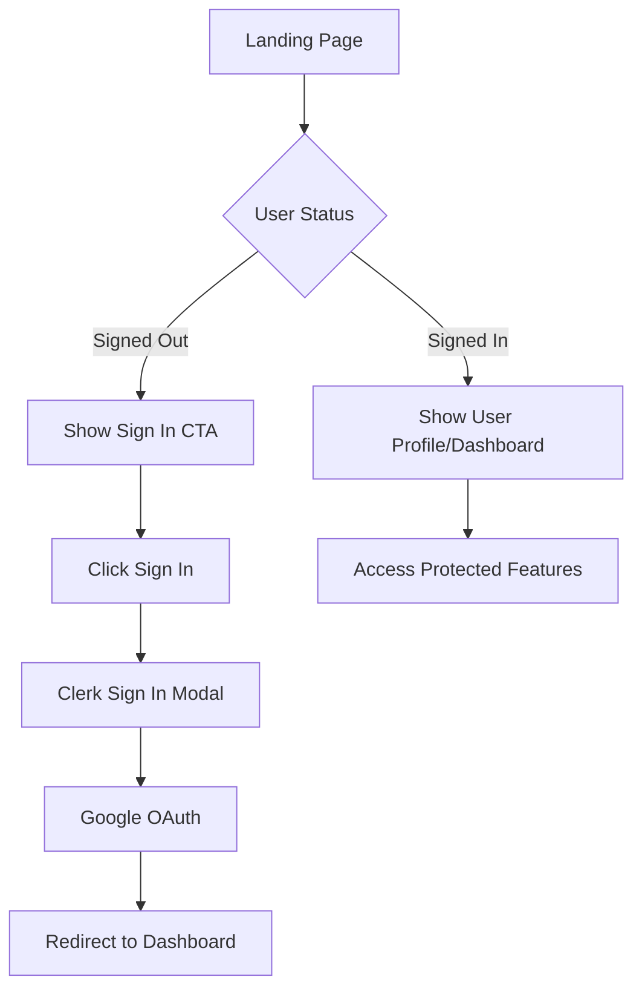

# Clerk Authentication Integration - Technical Architecture Document

## 1. Architecture Design



## 2. Technology Description

- **Frontend**: React@18 + TypeScript + Vite + React Router@7 + Tailwind CSS@3
- **Authentication**: Clerk React SDK + Google OAuth
- **State Management**: Clerk's built-in authentication state
- **UI Components**: Clerk's pre-built UI components
- **Environment**: Vite environment variables

## 3. Route Definitions

| Route | Purpose | Protection Level |
|-------|---------|------------------|
| / | Landing page with hero, features, and CTA | Public |
| /sign-in | Clerk sign-in page with Google OAuth | Public (redirects if authenticated) |
| /sign-up | Clerk sign-up page with Google OAuth | Public (redirects if authenticated) |
| /dashboard | User dashboard (post-authentication) | Protected |
| /profile | User profile management | Protected |
| /other | Additional pages | Public/Protected (configurable) |

## 4. Authentication Flow

### 4.1 User Authentication Process



### 4.2 Protected Route Logic



## 5. Component Architecture

### 5.1 Authentication Components Structure



### 5.2 Clerk Integration Points

| Component | Purpose | Clerk Hook/Component |
|-----------|---------|---------------------|
| App.tsx | Root provider setup | ClerkProvider |
| Navigation.tsx | User authentication status | UserButton, SignedIn, SignedOut |
| ProtectedRoute.tsx | Route protection | useAuth hook |
| SignInPage.tsx | Sign-in interface | SignIn component |
| SignUpPage.tsx | Sign-up interface | SignUp component |
| Dashboard.tsx | User dashboard | useUser hook |

## 6. Environment Configuration

### 6.1 Required Environment Variables

```bash
# Clerk Configuration
VITE_CLERK_PUBLISHABLE_KEY=pk_test_Z3VpZGluZy1sbGFtYS00OS5jbGVyay5hY2NvdW50cy5kZXYk
CLERK_SECRET_KEY=sk_test_LzLuNrt9qyqJDFJRK0cncPTpG6sp4atSH95sLNYQpa
VITE_CLERK_FRONTEND_API_URL=https://guiding-llama-49.clerk.accounts.dev
```

### 6.2 Vite Configuration Updates

```typescript
// vite.config.ts
export default defineConfig({
  // ... existing config
  define: {
    'process.env.VITE_CLERK_PUBLISHABLE_KEY': JSON.stringify(process.env.VITE_CLERK_PUBLISHABLE_KEY),
  }
})
```

## 7. Implementation Dependencies

### 7.1 Required Package Installations

```json
{
  "dependencies": {
    "@clerk/clerk-react": "^4.30.0",
    "react": "^18.3.1",
    "react-dom": "^18.3.1",
    "react-router-dom": "^7.3.0"
  }
}
```

### 7.2 TypeScript Definitions

```typescript
// types/auth.ts
export interface User {
  id: string;
  emailAddress: string;
  firstName?: string;
  lastName?: string;
  imageUrl?: string;
}

export interface AuthContextType {
  isLoaded: boolean;
  isSignedIn: boolean;
  user: User | null;
}
```

## 8. Security Considerations

### 8.1 Authentication Security

- **OAuth Flow**: Secure Google OAuth 2.0 implementation
- **Token Management**: Clerk handles JWT tokens securely
- **Session Management**: Automatic session refresh and validation
- **HTTPS Only**: All authentication endpoints use HTTPS

### 8.2 Route Protection

- **Client-side Protection**: React Router guards with Clerk hooks
- **Redirect Handling**: Automatic redirect to sign-in for unauthenticated users
- **State Persistence**: Authentication state persists across browser sessions

## 9. User Experience Flow

### 9.1 Landing Page Integration



### 9.2 Navigation Updates

- **Signed Out State**: Show "Sign In" and "Sign Up" buttons
- **Signed In State**: Show UserButton with profile dropdown
- **Responsive Design**: Mobile-friendly authentication UI
- **Seamless Integration**: Matches existing Tailwind CSS styling

## 10. Development Workflow

### 10.1 Setup Steps

1. Install Clerk React SDK
2. Configure environment variables
3. Wrap App with ClerkProvider
4. Create authentication pages
5. Implement protected routes
6. Update navigation components
7. Test authentication flow

### 10.2 Testing Strategy

- **Authentication Flow**: Test sign-in/sign-up with Google
- **Route Protection**: Verify protected routes redirect properly
- **User State**: Test user data persistence and logout
- **Error Handling**: Test network failures and invalid states
- **Mobile Responsiveness**: Test on various screen sizes

## 11. Deployment Considerations

### 11.1 Environment Setup

- **Development**: Use test keys for local development
- **Production**: Configure production Clerk keys
- **Domain Configuration**: Set up allowed origins in Clerk dashboard
- **SSL Certificate**: Ensure HTTPS for production deployment

### 11.2 Performance Optimization

- **Code Splitting**: Lazy load authentication components
- **Bundle Size**: Tree-shake unused Clerk components
- **Caching**: Leverage Clerk's built-in caching mechanisms
- **Loading States**: Implement proper loading indicators

This architecture provides a secure, scalable, and user-friendly authentication system that integrates seamlessly with your existing React landing page while maintaining the current user experience and design consistency.