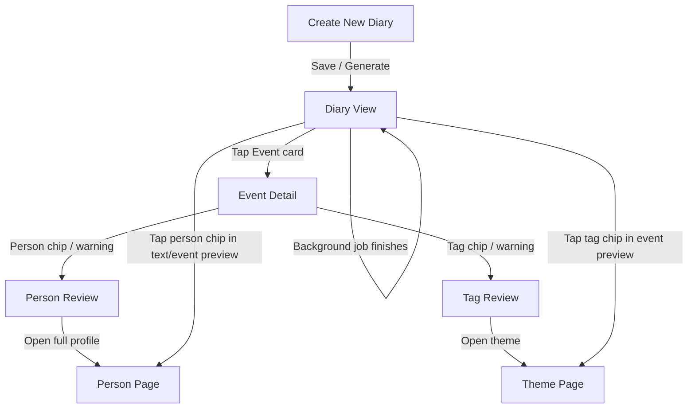

# UI / UX Design

## Flow Diagram

- A high-level flow diagram (text / mermaid style)
- Then a short section per screen: what’s on it, how you get there, what actions do

---

### 1. High-level flow diagram

You can drop this into Mermaid if you want:



And the background pipeline (happens after Save):

```mermaid
flowchart LR
J[JournalEntry saved] --> P1[Extract events (LLM)]
P1 --> P2[Resolve people names -> Person IDs]
P2 --> P3[Normalize tags -> update UserThemes]
P3 --> P4[Create / update Events]
P4 --> UI[Update Diary / Timeline UI badges]
```

---

### 2. Screen by screen

#### 1) Create New Diary Screen (existing)

**Entry points**
- From Diary tab “+” button
- From quick capture (voice/text)

**Key UI**
- Title (optional)
- Text area
- Media picker (photos/videos)
- Buttons:
    - Save
    - Generate song (or same button with different label)

**User actions & backend**
- **Save or Generate:**
    - **Immediately:**
        - `createJournalEntry` (store text + media)
        - If “Generate”, also start music gen as you do now
    - **Async:**
        - Enqueue `processJournalEntry(journalId)`
        - extract events (LLM)
        - resolve people
        - normalize tags & update themes
        - create Events

**Navigation**
- **After Save:**
    - go to Diary View for that entry (ideal)
    - or back to timeline, but Diary View is where we surface memory structure

---

#### 2) Diary View Screen (new, richer)

This is like your screenshot, but with memory bits layered in.

**Entry points**
- After creating a diary
- From Diary list / Timeline

**Key UI sections**
- **Header:** time, date, title (“A Day of Reflection”)
- **Body:** full journal text + media (unchanged from now)
- **Background pipeline status:**
    - a small progress / status bar area under the text:
    - “Extracting memories…” (spinner)
    - then:
        - ✅ Memories extracted
        - ⚠️ Needs review (if any ambiguous persons/tags)
- **Events summary section (when ready):**
    - “Memories from this entry”
    - List of Event preview cards, e.g.:
        - “Hiking trip with other founders”
        - chips for people: Raphaella, Kshitij, Yasmine
        - chips for tags: founders, outdoors
        - mood dot / importance
        - small ⚠️ icon if something needs attention

**User actions**
- Tap Event card → go to Event Detail
- Tap person chip:
    - small popover:
        - “View profile” → Person Page
        - “Edit name / relationship” → Person Review inline
- Tap tag chip:
    - quick remove / edit
    - “Open theme” → Theme Page
- Tap Regenerate from journal (small link/button if you want):
    - calls `regenerateEventsForJournal(journalId)` (delete + re-extract)

**What happens under the hood**
- Screen subscribes to:
    - `JournalEntry`
    - `Events` for this journal
- While Events not ready:
    - show “processing” state
- Once ready:
    - render Event previews
    - show any ⚠️ if `Event.meta` says review is needed

---

#### 3) Event Detail Screen

Focused view of a single derived memory.

**Entry points**
- Tap an Event in Diary View
- Tap an Event in Timeline / Themes / Person page

**Key UI**
- Event title (editable): “Hiking trip with other founders”
- Time & date
- Short + long summary (editable)
- **People row:**
    - person chips:
        - Raphaella, Kshitij, Yasmine
    - chips with avatar, relationship label (“founder friend”)
    - ⚠️ badge on a chip if ambiguous
- **Tags row:**
    - tag chips: founders, outdoors, community
    - “+ Add tag” input
- **Emotion / importance:**
    - mood (emoji or label)
    - importance slider (1–10)
- **Small “From journal” section:**
    - snippet of original text for context (read-only)

**User actions**
- Edit title / summaries → `updateEvent`
- Tap person chip:
    - if ⚠️ → Person Review sheet (resolve which person)
    - else → open Person Page
- “Add person” → Person search / “Create new person”
- Edit tags:
    - tap X to remove
    - add new text → new tag
- Change mood / importance

**Under the hood**
- `updateEvent(eventId, patch)`:
    - updates title/summary/tags/personIds
    - updates Person stats if personIds change
    - updates UserTheme counts if tags change

---

#### 4) Person Review (inline or bottom sheet)

This is the quick “resolve ambiguity / enrich info” moment.

**Entry points**
- Tap a person chip with ⚠️ on Event Detail
- Tap person chip on Diary View if flagged

**UI (bottom sheet)**
- **Title:** “Who is Raphaella here?”
- **If multiple candidates:**
    - radio list:
        - Raphaella (founder friend – 3 past events)
        - Raphaella R. (Scrappy Founders organizer)
        - “Create new person”
- **If one candidate (new person):**
    - simple form:
        - Full name: prefilled with “Raphaella”
        - Relationship: [ founder friend / organizer / other ]
        - Optional: “Use a photo from this entry as their picture?”

**User actions**
- **Choosing an existing person:**
    - updates `Event.personIds`
    - merges ambiguous person if needed
- **Creating new:**
    - creates Person
    - links to Event
- **Optionally:**
    - “Edit full profile” → go to Person Page

---

#### 5) Tag Review

Very similar pattern to Person Review, but lighter-weight.

**Entry points**
- Tap tag chip with ⚠️
- Or open via a “Manage themes” link later

**UI**
- “How should we treat ‘12 Scrappy Founders’?”
- **Options:**
    - Keep as tag
    - Merge with existing tag/theme (founders, community)
    - Hide/ignore this tag
- **For generic tags, probably just:**
    - Rename / delete

Most of the time you won’t even need a special review screen; users can edit tags directly in place on the Event Detail screen.

---

#### 6) Dedicated Person Page

This is your “personal CRM” view for a person, without calling it CRM.

**Entry points**
- Tap person chip → “View profile”
- From People list (if you have one)

**Key UI**
- **Header:**
    - Name: “Raphaella”
    - Relationship: “founder friend”, “organizer”
    - Avatar (user-chosen photo or initials)
- **Summary / highlights (later from LLM summarizing events):**
    - “You’ve mentioned Raphaella 4 times since 2025.”
    - “You met at 12 Scrappy Founders hike.”
- **Sections:**
    1. **Recent moments**
        - list of Event cards involving this person
    2. **Details**
        - Editable fields: full name, org, role, birthday, notes
        - (later) email, phone, address
    3. **Themes with this person (derived)**
        - chips like founders, outdoors, evokee with counts
- **Actions:**
    - “Edit profile”
    - (future) “Export to contacts” / “Link to phone contact”

**Under the hood**
- `getPersonDetail(userId, personId)`:
    - Person
    - recent Events (filter by personIds contains personId)
    - aggregated themes for those Events
- `updatePerson(personId, patch)` for editing details.

---

#### 7) Dedicated Theme (Tag) Page

This is the lens: “show me my life through founders / outdoors / family.”

**Entry points**
- Tap a tag chip → “Open theme”
- From Themes tab listing all major themes

**Key UI**
- **Header:**
    - Theme name: “Founders”
    - Emoji/color
    - Short description (editable)
- **Stats:**
    - “12 memories tagged with founders”
    - Mood distribution (simple: mostly positive, etc.)
- **Sections:**
    1. **Recent events**
        - Event list where tags include this theme/aliases
    2. **People most associated**
        - Person chips: Raphaella, Kshitij, Yasmine, etc.
    3. **Related themes**
        - chips of co-occurring tags: outdoors, community, evokee

**Actions**
- Edit display name / emoji / description
- Merge theme with another one (later)
- Hide theme (if you don’t want it in main list)

**Under the hood**
- `getUserThemes(userId)` for list page.
- `getEventsForTheme(userId, themeId)`:
    - load theme aliases
    - find Events where tags intersect with aliases
- Derive top people by counting person occurrences in those Events.

